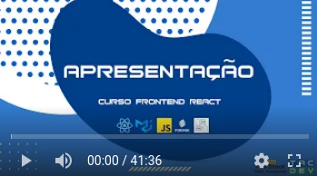
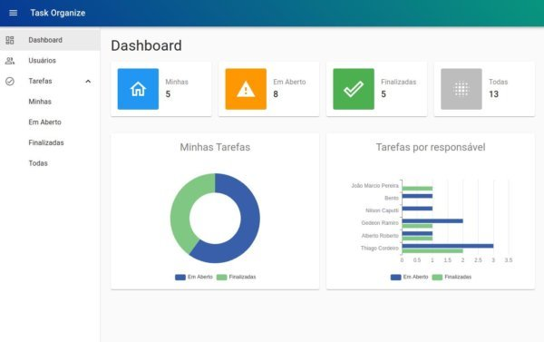
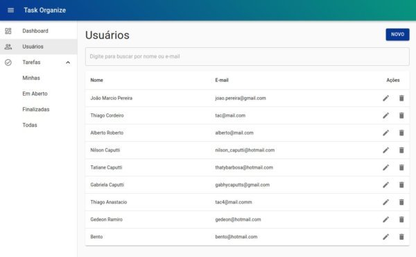
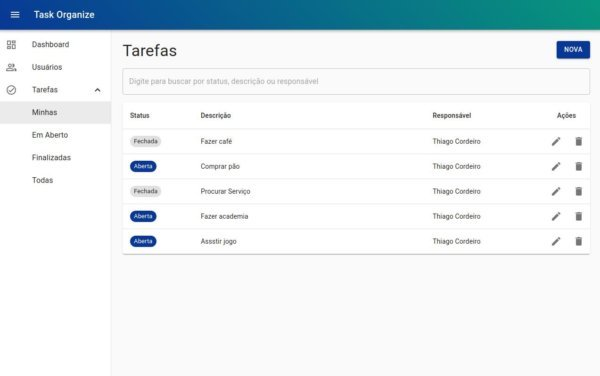

# curso-fullstack-devinvestidor-react

### Repositório do [Curso Frontend React](https://www.youtube.com/watch?v=bxdLk93idaQ&list=PLl4e5NAFzX70Eo0hshlHzmrYi9IG0bYxq) disponível gratuitamente no YouTube:

### Um pouco do que vamos desenvolver ao longo do curso:

#### Entre a nossa comunidade do Discord, todo feedback sobre o curso será muito bem recebido 👇👇

👥 Comunidade no Discord: https://bit.ly/discord-tac-dev

🚀 Instagram: https://www.instagram.com/tac.dev
